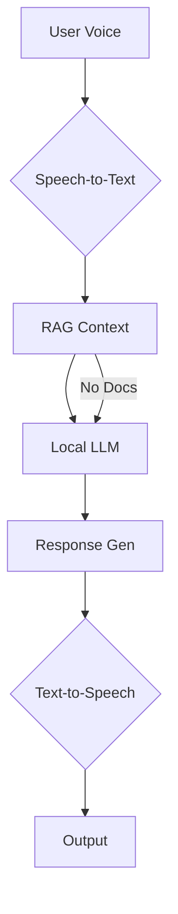

# Conversational Agent System (Ubiq-Genie Fork)

[](https://opensource.org/licenses/MIT)

> **Fork Note**: This project extends the [Ubiq-Genie](https://github.com/ubicomplab/ubiq-genie) framework with local LLM integration and enhanced RAG capabilities.

> **Branch Note**: This is the stable single-room version. For multi-room support with concurrent activities, see the [multi-room-support](https://github.com/SysEngTeam20/rag-enabled-ubiq-genie/tree/multi-room-support) branch. Note that while the multi-room branch offers better scalability (1 room = 1 scene), it currently has a minor bug with audio WebRTC transmission between Unity clients and Genie agents, which is why it's not merged into this main branch.

A real-time voice AI agent with document context awareness powered by:

- Local LLM inference (Llama.cpp compatible)
- Retrieval-Augmented Generation (RAG)
- Secure JWT-authenticated document access

## Features

- 🎙️ **Voice Interface**: Real-time STT/TTS conversion
- 🧠 **Local Inference**: Private processing via compiled LLM server
- 📚 **Context Awareness**: FAISS vector store (lines 46-72 `rag_service.py`)
- 🔒 **Secure Access**: JWT document fetching (lines 88-100 `rag_service.py`)
- 👥 **Multi-User Support**: Multiple users can interact with the agent in the same room
- 🏠 **Single Room**: One agent instance per room with dedicated RAG context for that activity

## System Architecture



## Requirements

### Core Dependencies
- Python 3.10+
- Node.js 20+
- FAISS vector store
- Sentence-transformers

### Local LLM Server

Please refer to the [Compiled Granite Server repository](https://github.com/SysEngTeam20/compiled-granite-server) for instructions on how to compile and run the local LLM server.

### Admin App and Document Server

Please refer to the [Portalt Admin App repository](https://github.com/SysEngTeam20/portalt-admin-app) for instructions on how to compile and run the admin app, which includes the Document Server.

## Quick Start

1. **Clone & Setup**
```bash
# Clone the repository
git clone https://github.com/SysEngTeam20/rag-enabled-ubiq-genie.git
cd rag-enabled-ubiq-genie

# Set up Python environment
python -m venv venv
source venv/bin/activate  # On Windows: venv\Scripts\activate
pip install -r requirements.txt

# Set up Node.js environment
cd Node
npm install
```

2. **Configure Environment** (`.env.local`)

Create `.env.local` in your project root with these required variables:

```ini
# API Configuration
API_BASE_URL=http://localhost:3000  # Base URL for document API
API_SECRET_KEY=yrFvjWY7a6RUEZyu      # JWT signing secret (must match document server)

# LLM Configuration
LLM_SERVER=http://localhost:8080     # Local LLM server endpoint
LLM_PORT=8080                        # Default port for LLM server

# Activity Configuration  
ACTIVITY_ID=  # Default activity ID for document retrieval

# WebSocket Configuration
WEBSOCKET_SERVER_URL=ws://localhost:5001  # WebSocket server URL for STT/TTS services
```

### Variable Details

| Variable | Required | Description | Example | Code Reference |
|----------|----------|-------------|---------|----------------|
| `API_BASE_URL` | Yes | Base URL for document API | `http://doc-server:3000` | `rag_service.py:88` |
| `API_SECRET_KEY` | Yes | JWT signing secret (32+ chars) | `secure-secret-123` | `service.ts:20` |
| `LLM_SERVER` | Yes | LLM server host/port | `http://192.168.1.10:8080` | `rag_service.py:146` |
| `LLM_PORT` | Yes | LLM server port | `8080` | `app.ts:13` |
| `ACTIVITY_ID` | Yes | Default activity ID, to be generated by the admin app's api | `0742fc56-8e73-4d73-9488-60a3d936351b` | `service.ts:8` |
| `WEBSOCKET_SERVER_URL` | Yes | WebSocket server URL for STT/TTS | `ws://localhost:5001` | `service.ts:76` |

> **Security Note**: Keep `API_SECRET_KEY` confidential. Never commit it to version control.

3. **Launch System**

```bash
# Make sure you're in the Node directory
cd Node

# Start the conversational agent
cd apps/conversational_agent
npm start
```

## Testing

**Direct LLM Test**:

**RAG Pipeline Test**:
```bash
python test-rag.py --query "What's our return policy?" \
  --activity_id retail-docs
```

## Documentation

| Component | Key Files | 
|-----------|-----------|
| RAG Service | `rag_service.py` (lines 46-175) |
| Text Generation | `service.ts` (lines 8-48) | 
| Agent Core | `app.ts` (lines 13-38) |

## License

MIT License - See [LICENSE](LICENSE)

## Acknowledgements

This project is a fork of the Ubiq-Genie framework:
- Original Paper: [Ubiq-Genie: Framework for Developing Mixed Reality Experiences](https://ubiq.online/publication/ubiq-genie/)
- Demo Video: [YouTube Walkthrough](https://youtu.be/cGz0z9BIgQk)
- Parent Repository: [Ubiq-Genie GitHub](https://github.com/ubicomplab/ubiq-genie)

## External Dependencies

### WebSocket Server for STT/TTS

The speech-to-text and text-to-speech services rely on a separate WebSocket server for real-time audio processing. This server is maintained in a separate repository:

- Repository: [stt-tts-compiled-whisper-server](https://github.com/SysEngTeam20/stt-tts-compiled-whisper-server)
- Features:
  - Real-time speech-to-text using Faster Whisper
  - Real-time text-to-speech using WhisperSpeech
  - WebSocket-based streaming audio processing
  - HTTP endpoints for file-based operations

To use the STT/TTS services:

1. Clone and set up the WebSocket server:
```bash
git clone https://github.com/SysEngTeam20/stt-tts-compiled-whisper-server.git
cd stt-tts-compiled-whisper-server
python -m venv venv
source venv/bin/activate  # On Windows: venv\Scripts\activate
pip install -r requirements.txt
python server.py
```

2. The server will start on `ws://localhost:5001` by default. Configure this URL in your `.env` file:
```
WEBSOCKET_SERVER_URL=ws://localhost:5001
```

## Environment Setup

1. Clone the repository:
```bash
git clone https://github.com/SysEngTeam20/ubiq-genie.git
cd ubiq-genie
```

2. Set up Python environment:
```bash
python -m venv venv
source venv/bin/activate  # On Windows: venv\Scripts\activate
pip install -r requirements.txt
```

3. Set up Node.js environment:
```bash
cd Node
npm install
```

4. Configure environment variables:
```bash
cp .env.template .env.local
# Edit .env.local with your configuration
```

5. Launch the system:
```bash
cd Node
npm start conversational_agent
```

## Deployment

### Docker Deployment

1. Build the Docker image:
```bash
docker build -t ubiq-genie:latest .
```

2. Run the container:
```bash
docker run -p 8000:8000 \
  --env-file .env \
  ubiq-genie:latest
```

### Kubernetes Deployment on IBM Cloud

1. Install the IBM Cloud CLI and Kubernetes CLI (kubectl)

2. Log in to IBM Cloud:
```bash
ibmcloud login
```

3. Create a Kubernetes cluster (if not already created):
```bash
ibmcloud ks cluster create classic --name ubiq-genie-cluster
```

4. Get cluster credentials:
```bash
ibmcloud ks cluster config --cluster ubiq-genie-cluster
```

5. Create secrets from template:
```bash
cp k8s/secrets.template.yaml k8s/secrets.yaml
# Edit k8s/secrets.yaml with your values
kubectl apply -f k8s/secrets.yaml
```

6. Deploy the application:
```bash
kubectl apply -f k8s/deployment.yaml
kubectl apply -f k8s/service.yaml
```

7. Get the external IP:
```bash
kubectl get service ubiq-genie
```

### Monitoring and Maintenance

- View logs:
```bash
kubectl logs -f deployment/ubiq-genie
```

- Scale the deployment:
```bash
kubectl scale deployment ubiq-genie --replicas=2
```

- Update the deployment:
```bash
kubectl rollout restart deployment ubiq-genie
```

- Delete the deployment:
```bash
kubectl delete -f k8s/deployment.yaml
kubectl delete -f k8s/service.yaml
kubectl delete -f k8s/secrets.yaml
```

## Development

### Adding New Services

1. Create service directory in `Node/services/`
2. Implement service controller
3. Add required Python scripts
4. Register in application pipeline

### Adding New Applications

1. Create application directory in `Node/apps/`
2. Implement application controller
3. Configure in `config.json`
4. Create Unity scene

## Related Repositories

- [compiled-granite-server](https://github.com/SysEngTeam20/compiled-granite-server) - Local LLM server
- [stt-tts-compiled-whisper-server](https://github.com/SysEngTeam20/stt-tts-compiled-whisper-server) - STT/TTS WebSocket server
- [portalt-admin-app](https://github.com/SysEngTeam20/portalt-admin-app) - Admin app for managing activities and rooms

> Note: Each repository maintains its own deployment configurations. Please refer to their respective documentation for deployment instructions.