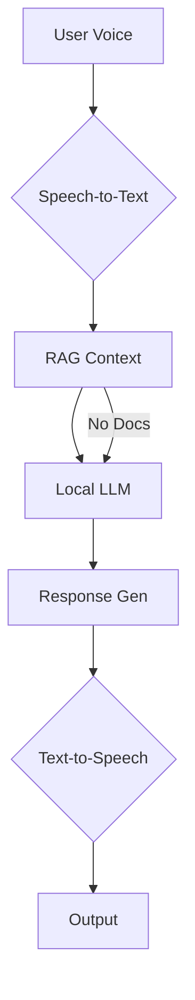

# Conversational Agent System (Ubiq-Genie Fork)

[](https://opensource.org/licenses/MIT)

> **Fork Note**: This project extends the [Ubiq-Genie](https://github.com/ubicomplab/ubiq-genie) framework with local LLM integration and enhanced RAG capabilities.

A real-time voice AI agent with document context awareness powered by:

- Local LLM inference (Llama.cpp compatible)
- Retrieval-Augmented Generation (RAG)
- Secure JWT-authenticated document access

## Features

- 🎙️ **Voice Interface**: Real-time STT/TTS conversion
- 🧠 **Local Inference**: Private processing via compiled LLM server
- 📚 **Context Awareness**: FAISS vector store (lines 46-72 `rag_service.py`)
- 🔒 **Secure Access**: JWT document fetching (lines 88-100 `rag_service.py`)
- 👥 **Multi-User**: Concurrent conversation tracking (lines 13-18 `app.ts`)

## System Architecture



## Requirements

### Core Dependencies
- Python 3.10+
- Node.js 20+
- FAISS vector store
- Sentence-transformers

### Local LLM Server

Please refer to the [Local LLM Server repository](https://github.com/SysEngTeam20/native-granite-compilation) for instructions on how to compile and run the local LLM server.

## Quick Start

1. **Clone & Setup**
```bash
git clone https://github.com/SysEngTeam20/rag-enabled-ubiq-genie.git
cd rag-enabled-ubiq-genie
pip install -r requirements.txt
npm install
```

2. **Configure Environment** (`.env.local`)
```ini
API_BASE_URL=http://localhost:3000
API_SECRET_KEY=your_jwt_secret
LLM_SERVER=http://localhost:8080
```

3. **Launch System**

```bash
# Start Node.js Agent
cd Node/apps/conversational_agent
npm start
```

## Testing

**Direct LLM Test**:

**RAG Pipeline Test**:
```bash
python test-rag.py --query "What's our return policy?" \
  --activity_id retail-docs
```

## Documentation

| Component | Key Files | 
|-----------|-----------|
| RAG Service | `rag_service.py` (lines 46-175) |
| Text Generation | `service.ts` (lines 8-48) | 
| Agent Core | `app.ts` (lines 13-38) |

## License

MIT License - See [LICENSE](LICENSE)

## Acknowledgements

This project is a fork of the Ubiq-Genie framework:
- Original Paper: [Ubiq-Genie: Framework for Developing Mixed Reality Experiences](https://ubiq.online/publication/ubiq-genie/)
- Demo Video: [YouTube Walkthrough](https://youtu.be/cGz0z9BIgQk)
- Parent Repository: [Ubiq-Genie GitHub](https://github.com/ubicomplab/ubiq-genie)