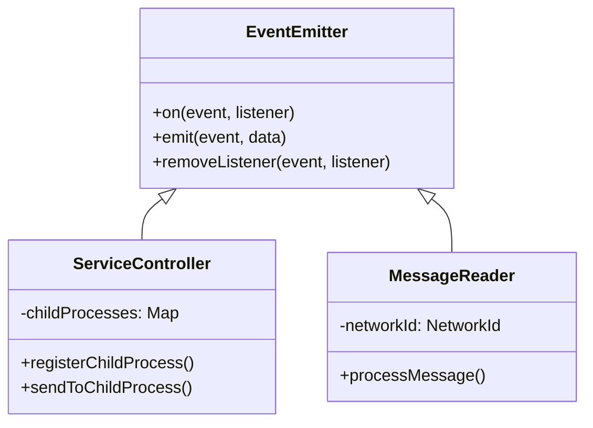
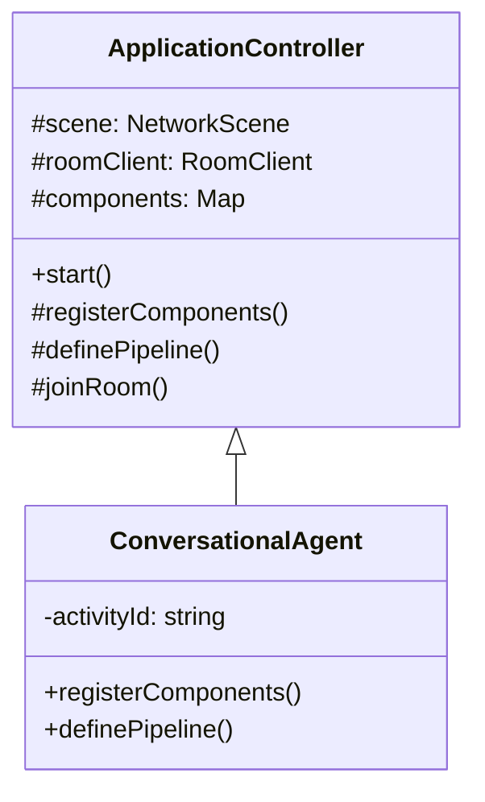
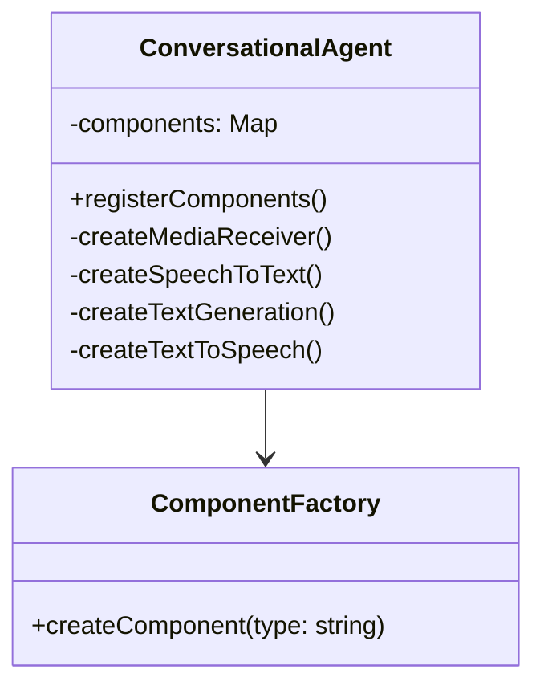
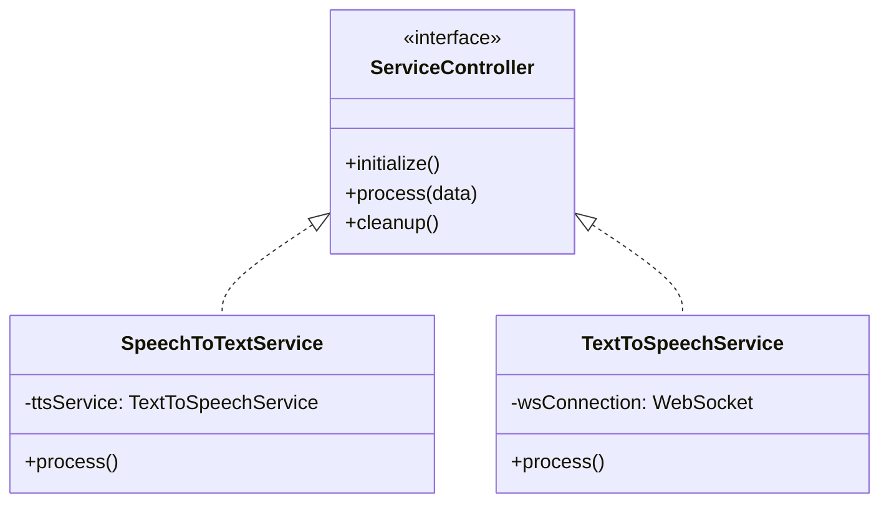
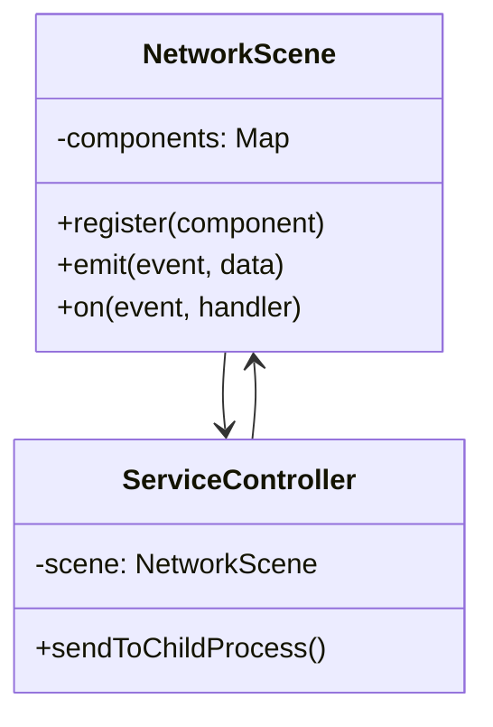
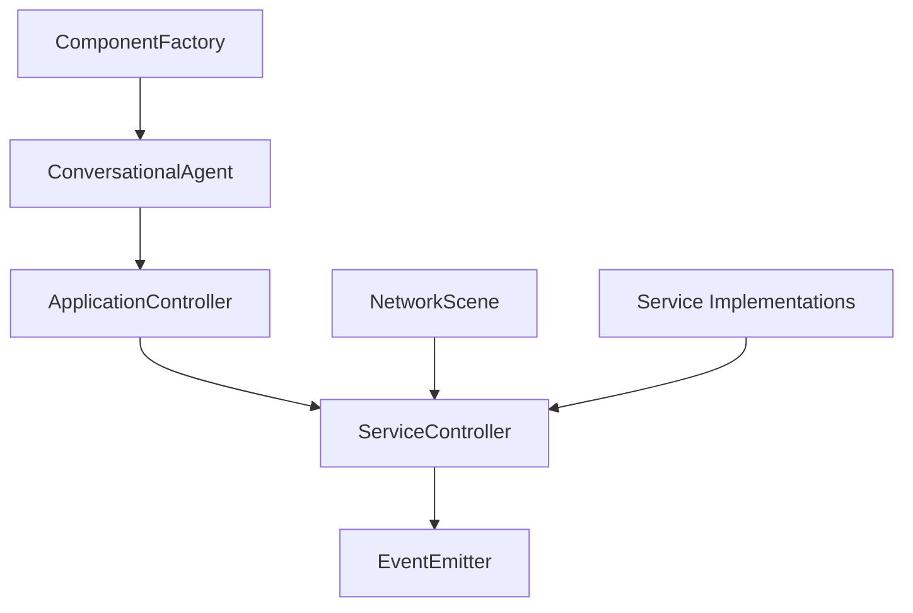

# Design Patterns in Ubiq-Genie

## 1. Observer Pattern
**Purpose**: Event handling and communication between components
**Implementation**: 
- Base class: `EventEmitter` from Node.js
- Used in: `ServiceController`, `MessageReader`, `MediaReceiver`
- Key features:
  - Event-based communication
  - Loose coupling between components
  - Asynchronous event handling

## 2. Template Method Pattern
**Purpose**: Standardize service initialization and lifecycle
**Implementation**:
- Base class: `ApplicationController`
- Used in: `ConversationalAgent`
- Key features:
  - Abstract initialization steps
  - Consistent component registration
  - Standardized pipeline definition

## 3. Factory Pattern
**Purpose**: Component creation and initialization
**Implementation**:
- Used in: `ConversationalAgent.registerComponents()`
- Key features:
  - Centralized component creation
  - Dependency injection
  - Component lifecycle management

## 4. Strategy Pattern
**Purpose**: Service implementation variations
**Implementation**:
- Used in: Service implementations (STT, TTS, RAG)
- Key features:
  - Interchangeable service implementations
  - Runtime service selection
  - Service-specific configuration

## 5. Mediator Pattern
**Purpose**: Centralized communication control
**Implementation**:
- Used in: `NetworkScene` as mediator
- Key features:
  - Centralized message routing
  - Decoupled component communication
  - Event coordination

## Pattern Relationships

## Benefits of the Pattern Usage

1. **Modularity**: Each pattern contributes to the system's modular architecture
2. **Extensibility**: Easy to add new services and components
3. **Maintainability**: Clear separation of concerns
4. **Testability**: Components can be tested in isolation
5. **Scalability**: Patterns support distributed architecture

## Implementation Guidelines

1. **Service Creation**:
   - Extend `ServiceController`
   - Implement required event handlers
   - Register with `NetworkScene`

2. **Application Development**:
   - Extend `ApplicationController`
   - Define component pipeline
   - Implement service-specific logic

3. **Component Communication**:
   - Use event-based communication
   - Follow mediator pattern for routing
   - Maintain loose coupling 