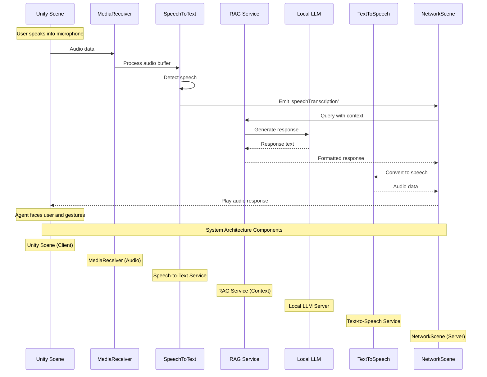

```mermaid
sequenceDiagram
    participant Unity as Unity Scene
    participant Media as MediaReceiver
    participant STT as SpeechToText
    participant RAG as RAG Service
    participant LLM as Local LLM
    participant TTS as TextToSpeech
    participant Network as NetworkScene

    Note over Unity: User speaks into microphone

    Unity->>Media: Audio data
    Media->>STT: Process audio buffer
    STT->>STT: Detect speech
    STT->>Network: Emit 'speechTranscription'
    Network->>RAG: Query with context
    RAG->>LLM: Generate response
    LLM-->>RAG: Response text
    RAG-->>Network: Formatted response
    Network->>TTS: Convert to speech
    TTS-->>Network: Audio data
    Network-->>Unity: Play audio response

    Note over Unity: Agent faces user and gestures

    Note over Unity,Network: System Architecture Components
    Note over Unity: Unity Scene (Client)
    Note over Media: MediaReceiver (Audio)
    Note over STT: Speech-to-Text Service
    Note over RAG: RAG Service (Context)
    Note over LLM: Local LLM Server
    Note over TTS: Text-to-Speech Service
    Note over Network: NetworkScene (Server)
``` 